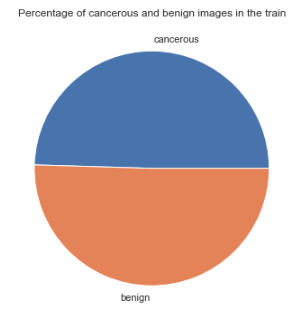
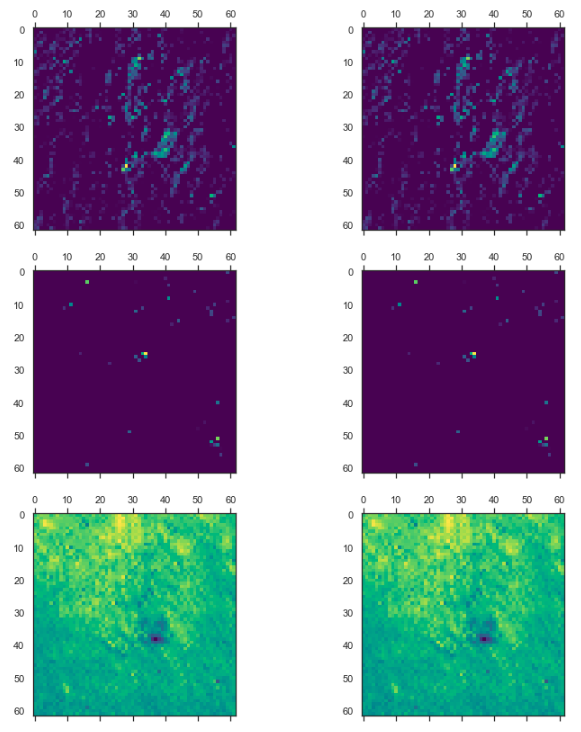

# Skin cancer detection with Convolutional Neural Networks

Student name: Maria Kuzmin
<br>Student pace: Flex
<br>Scheduled project review date/time: Wednesday, May 17th 1PM
<br>Instructor name: Morgan Jones

[Link](https://dev.to/mnlkuzmin/skin-cancer-detection-with-convolutional-neural-networks-3mh1) to my blog post about this project.


Skin cancer is by far the most common type of cancer.
<br>We want to build an app that analyzes pictures of skin anomalies to determine whether or not a skin anomaly is cancerous, to help healthcare providers make a diagnosis. 
<br>This app would be advantageous for doctors since their diagnosis will not only be based on their visual inspection of the skin but also supported by a powerful Neural Network model that compares the picture of a patient’s lesion with thousands (and potentially millions) of other ones, stored in a constantly growing database.
<br>The accuracy that we were able to achieve in building the core engine of the app (our CNN model) is between 70% and 80% for our 9 classes classification model.
<br>The recall rate that we obtained was about 85% in our binary classification model.

## Business Problem
According to one estimate, about 5.4 million cases of skin cancer are diagnosed among 3.3 million people each year (many people are diagnosed with more than one spot of skin cancer at the same time). 
<br>1 out of 5 Americans will develop skin cancer by the time they are 70.

Causes: Skin cancer occurs when errors (mutations) occur in the DNA of skin cells. The mutations cause the cells to grow out of control and form a mass of cancer cells.
<br>Risk factors: Fair skin, light hair, freckling, moles, history of sunburns, excessive sun exposure, sunny or high-altitude climates, precancerous skin lesions, weakened immune system, etc. 
<br>If you have skin cancer, it is important to know which type you have because it affects your treatment options and your outlook (prognosis). 
<br>If you aren’t sure which type of skin cancer you have, it is recommended that you ask your doctor so you are properly aware. 
<br>A doctor will usually do an examination looking at all the skin moles, growths and abnormalities to understand which ones are at risk for being cancerous.
<br>But what if the doctor is not sure?
<br>What if we could develop a tool that could help the doctor decide with more confidence and ensure more safety for every patient?
<br>What if, to make a decision about a patient, the doctor could have the support of advanced technology and a model that makes its determination based on a direct comparison with thousands of other cases?
<br>This is what we are trying to achieve in this project.

When the model is ready to be used in the field, we could develop a cell phone app. 
<br>This app would use the cell phone camera and it would return the type of skin anomaly and the percentage probability of it being cancerous. 
<br>The app would also allow the user to upload the images to a database so the model will continue to improve in accuracy over time.
<br>The app also gives the chance to the healthcare provider to see what parts of the image the model used to decide which class the skin anomaly belongs to and to visualize the image under the different filters used to make the determination. 

Sources:
<br>[Cancer.org/skin-cancer](https://www.cancer.org/cancer/skin-cancer.html)
<br>[Cancer.org/skin-cancer-statistics](https://www.cancer.org/cancer/melanoma-skin-cancer/about/key-statistics.html)
<br>[Skincancer.org](https://www.skincancer.org/skin-cancer-information/)
<br>[MayoClinic/Skin-cancer](https://www.mayoclinic.org/diseases-conditions/skin-cancer/symptoms-causes/syc-20377605#:~:text=Skin%20cancer%20%E2%80%94%20the%20abnormal%20growth,squamous%20cell%20carcinoma%20and%20melanoma.)


## Business Stakeholder
The American Academy of Dermatologists ([website](https://www.aad.org/)) offers free skin cancer screenings all over the United States.
<br>We feel they could strongly benefit from our app by supporting their doctors whenever they need to determine the nature of any skin lesions they are examining.
<br>The app does not only return a determination of ‘benign’ or ‘malignant’ but it provides also the certainty with which the determination was made.
<br>It allows the doctor to set a ‘threshold’ over which the image is determined to be at risk for cancer (the default would be 50% but it can be lowered to catch more cases at risk). <br>The app will also show which part of the images the model focuses on to make its determination and show filters that the model applied to the image. <br>In this way, since the granularity that a computer can scan is higher than the one of the human eye, the model might have catch details that the doctor did not, and thus make a more informed assessment.
<br>The app cannot substitute the critical judgment of a human being, but by the power that this technology offers, we feel this could be a very useful tool to support a doctor in his decision.

## Summary:

Our data consisted of pictures taken of skin anomalies, with a total of 2357 images, that belong to 9 different classes of skin disorders.
<br>The goal of the project was to build a model that could classify the images, first in their 9 native classes, and secondly another model was built that would classify the images between cancerous and benign.

The Data preparation consisted in loading the images from their directory, from the original division into 9 subfolders, and later creating new directories for the binary classification, and copying the images in those directories.
<br>The data was already divided into test and train set.

Our models are all Convolution Neural Networks. We used Tensorflow with Keras backend, for building the models.
<br>We built sequential models with densely connected layers, and took advantage of regularizers and constraints to tune the models.
<br>Moreover to tune the models we ran some GridSearchCVs utilizing wrappers from scikeras, to select the best performing number of epochs and batch size, optimization algorithm, neuron activation function and number of neurons. Also L2 regularization and dropout regularization were a part of the tuning process.
<br>For validation, a cross validation was ran at every fitting of the model, setting aside a 20% validation set.
<br>During the grid searches, a 3-fold cross validation was used.
<br>Finally LIME and Visualization of Activation Layers was used for model explainability.

In terms of metrics: for the 9 classes model we used accuracy and loss to evaluate our models.
<br>For the binary classification instead we focused on recall, as often happens in the medical field, to try and minimize the cases of False Negatives. We also used f1 score and accuracy to keep track of the overall performance of the model.

The best 9 classes model reached a mean accuracy (calculated over 10 samples) between 70% and 80% on the train.
<br>When evaluated on the holdout test set the results were an average accuracy between 15% and 20% on the test.
<br>The binary classification model had a mean Recall of 80% and f1 of 85% on the train. 
<br>On the test we obtained a recall around 65% and f1 around 70%. Both with a recall threshold of 50%.
<br>When we moved the recall threshold to 30% the model reached on the test a recall of about 85%.

At the following [link](./RoapMap.md) we can find the roadmap of the project, for more details on the steps taken.

## Data Understanding:
Let us dig deeper into what each one of these classes are, and we will preview one image for each class to get a visual sense of what our model is going to be studying.

In particular we will divide the classes in two macro classes, benign and malignant, since we will also build a model to determine if the image is ultimately of benign or cancerous nature.


The firs five classes, Dermatofibroma Pigmented benign keratosis and Seborrheic keratosis, Nevus and Vascular lesion are benign, while the other 4 classes actinic keratosis, basal cell carcinoma, melanoma and squamous cell carcinoma are malignant.

The distribution of the 9 classes is as follows:


To divide into the 2 classes, benign and cancerous, we grouped together the benign classes in one class, and all the malignant classes in another.
We obtained this distribution:




## Models:

As we can see in the Roadmap, first we created a  model to idenfity which of the 9 classes the image belongs to.
<br>All the models used are convolutional Neural Netowrs (see details in the notebooks about their structure).
<br>We started with a Naive model, and with images of sixe 8X8 pixels, only one Convolutional Layer, one Pooling layer and one Dense layer.
<br>We increased the size of the images, at 32x32 and then at 64x64, and we continued for the rest of the model with this size.
<br>After that, we normalized the pixel values and then started to tune the models, running Grid Searchs on the following parameters: number of epochs, batch size, optimization algorithm, learning rate of optimization algorithm, neuron activation function, number of neurons. We also did some tuning to avoid overfitting, using L2 regularization and dropout regularization.
<br>We used accuracy and loss as metrics to keep track of the progress of our model.
<br>The model that we selected as the best one turned out to be the one we created right after tuning the number of neurons, model g.

<br>This model has the following parameters: 
<br>activation function = relu for each layer except last one softmax
<br>optimizer = Adam with learning rate 0.001
<br>neurons - 5 for each layer expect the last one in which they are 9

This model reached an mean accuracy between 70% and 80% and a mean loss between 0 and 2 on the train.
<br>For the test set the results were an average accuracy between 15% and 20% on the test and loss on the test on average between 6 and 14.

With this model we obtained the following confusion matrix:


Next we reorganized the images into 2 classes instead of 9: 'benign' and 'malignant'.
<br>We tuned the model using grid searches of the same paramters as the first model.
<br>In this case we chose two different metrics to evaluate the model, while still keeping an eye on accuracy and loss, we defined functions to extract the recall and f1 of our model.
<br>We chose the recall as our metric in this case because we wanted to try to minimize the cases of false negatives, and we kept monitoring also f1 to make sure the performance of our model remained good.


<br>The performance of the binary classification model was a little unstable but we found a way to select the best performing one and we found for the train a recall of around 80% and an f1 of roughly 85%.
<br>On the test we obtained a recall of around 65% and f1 of around 70%.
<br>When we lowered the recall threshold to 30% we obtained a recall for the test set of about 70%.

## LIME

Next for model explainability we used LIME.
In general what LIME does is it breaks the images into interpretable components called superpixels (clusters of contiguous pixels). It then generates a data set of perturbed instances by turning some of the interpretable components “off” (in this case, making some of the superpixels in our picture gray).

In this way we can see which were the parts of the image that led our model to believe that the picture belonged to the cancerous or non benign class.

This can be extremely useful to Doctors using our model because they don't need to believe blindly in our model, but for each one of the images they can extract what was the part of the picture that led the model to its conclusion, and whether the model focused on the wrong part or read the image correctly, the Dr can draw his conclusions, and make a more informed decision.

Example of image categorized correctly by the model:


We can notice how the model identified correctly which part of the image to focus on, which was the skin anomaly.

Example of image categorized incorrectly by the model:


We can see here how the model did not identify correctly the part of the image to focus on, and made its determination based on the skin around the lesion and not the lesion itself.
<br>The doctor by seeing this image will be warned that most likely the model made a mistake in the determination of the class of this image.


## Visualizing Activation Layers

One more thing that we can offer to the AAD to make more clear for the doctors what lead the model to its decision, is visualizing activation layers.
<br>This is part of how a Convolutional Neural Network works, in order to make its determination and classify an image. We can visualize the intermediate hidden layers within our CNN to uncover what sorts of features our deep network is uncovering through some of the various filters.
<br>As we mentioned before a CNN to learn about an image applies different filters, and this new representation of the image is called feature map. What we do when we visualize activation layers is that we look at feature maps and see number of channels. You can visualize each of these channels by slicing the tensor along that axis.


<br>We can also visualize all of the channels from one activation function, with a loop.




## Results

We built two different models, one that identified the images belonging to 9 different classes of skin anomalies.
<br>The best model we choose was `model_g` which was tuned to optimize many hyperparameters.
The characteristics of this model are:
<br>image size 64x64
<br>epochs 10, batch size 10
<br>optimization algorithm Adam, with learning rate 0.001
<br>optimization function 'relu', number of neurons 5

This model reached an accuracy of on average between 70% and 80% and a loss between 0 and 2 on the train.
<br>When evaluated on the holdout test set the results were an average accuracy between 15% and 20% on the test and loss on the test between 6 and 14.

The second model we built was a binary classification model, trying to identify if an image belonged to the 'benign' or 'cancerous' class.
<br>This model was tuned just like the previous one in terms of image size, number of epochs, batch size, optimization algorithm, activation function, number of neurons, regularization and dropout.
<br>The performance of this model was a little unstable but we found a way to select the best performing one (which changes given the stochastic nature of NNs) and in general, we were able to obtain for the train a recall of around 80% and an f1 of roughly 85%.
<br>On the test we obtained a recall of around 65% and f1 of around 70%.
<br>When we lowered the recall threshold to 30% we obtained a recall for the test set of about 70%.

We also used tools like LIME and Visualization of Activation Layers to make the model more explainable, so that if a physician is uncertain of the result of the model, or wanted to dig deeper for other reasons, they would have the chance to see more in-depth what was the way in which the model processed the image and made its determination.

## Limitations

Given the stochastic nature of the Neural Networks, we were not able to have permanent results. 
<br>We hope that by building a broader database of images and training the model several times whenever the database gets updated, we will be able to obtain more stable models with higher accuracy.
<br>There might be limitations to uploading the images in a database for patient privacy reasons, so a HIPAA form would have to be provided and signed by the patient to be able to use the images of their skin.

The set of images for the 9 classes was not balanced, which might have brought the first model to recognize better the more populated classes versus the less populated ones. With a more extensive database to train the model, this issue could be solved and the model could improve.

We had some technical limitations in terms of the running time of the code for which we could not run more grid searches or expand the ranges swept even more, or increase the number of layers or neurons of the model.
With more computational power or taking advantage of one of the cloud services higher accuracy could be achieved.

### Recommendations

- We know that black box models are scary and it can be hard to trust a computer with a patient's health. But we are not trying to substitute the physician, with his skill and critical thinking. But we believe our app can be such a useful tool to support the doctor in a situation of uncertainty, using the power of always-evolving technology.
- Use the app to its full potential, looking at LIME explanations and activation layers, and setting the threshold for images to be considered cancerous.
- Whenever a patient agrees to it, upload the images of their skin anomalies to make our database always growing, and help us to constantly improve our model.
- Report whenever there is a doubt or an error so that the model can be trained better.

## Next Steps

To improve our model and for a more in-depth study we could also:
* Balance out perfectly the classes in the 9 classes model by image augmentation, to obtain better results.
* Utilize more powerful tools like models available like Transfer Learning.
* Create a function that selects only the images classified incorrectly and runs them through the model again or to another more powerful model (Transfer Learning).
* Flagging images with uncertain probability. Most likely the images that are closer to error are the ones where the prediction is close to 0.5. We can select a range from 0.4 to 0.6 where the image instead of being classified gets flagged as an uncertain image and sent through the model again or through a more powerful model.
* Create the app that the American Academy of Dermatologists can use with the possibility to add images to the dataset, and periodically retrain and improve the model.
* Take a whole other set of skin lesion images and train our same model on them to increase its accuracy and flexibility.


## For More Information

Please review my full analysis in [my Jupyter Notebook](./SkinCancerDetection.ipynb) or my [presentation](./Presentation.pdf).

For any additional questions, please contact **Maria Kuzmin, marianlkuzmin@gmail.com**

## Repository Structure

Description of the structure of the repository and its contents:

```
├── GraphsandImages
│    ├── CM2test.png
│    ├── CM2train.png
│    ├── CM9Classes.png
│    ├── HeaderImage.jpg
│    ├── Image9Classes.png
│    ├── LIMEright.png
│    ├── LIMEwrong.png
│    ├── VALChannels1.png
│    ├── VALChannels2.png
│    ├── VALLayers.png
│    ├── histclass.png
│    └── plotclass.png
├── .gitignore
├── Presentation.pdf
├── README.md
├── Reproducibility.md
├── RoadMap.md
├── SkinCancerDetection.ipynb   
└── environment.yml
```

